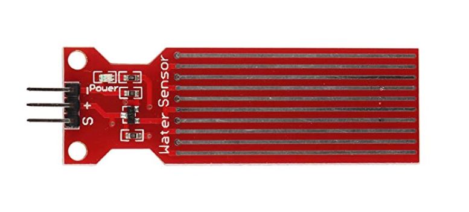

# App-PET-ite
 
**Project Description** 

The below schematic provides an outline for an automatic pet feeder. It dispenses food and liquid in a controlled manner, and montitors the amount of food/liquid. The pet is provided a RFID fob, which, in the vicinity of the the RFID reader, instructs the controller to dispense food with respect to an earlier programmed quantity. The water level and load are measured by sensors and provided to the Raspberry pi using SPI interface. The user is provided with a keypad and a LCD Panel to interact with the system.

**Project Overveiw** 
The basic layout of the project is given in the schematic below 

 
For this DIY project, we are using the Raspberry pi 3 Model B+ along with the folowing componenets list. 

**Electrical Component List** 
1) Analog water sensor                                                        
Analog water sensor 
Analog Weight Sensor (HX711) 
Analog-to-digital Converter (MCP3008)  
RFID transmitter and receiver  
DC Motor 6V 150 RPM 

**Social Media Profiles** 
