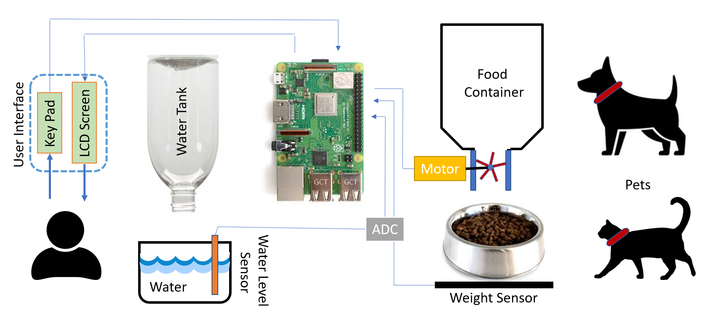
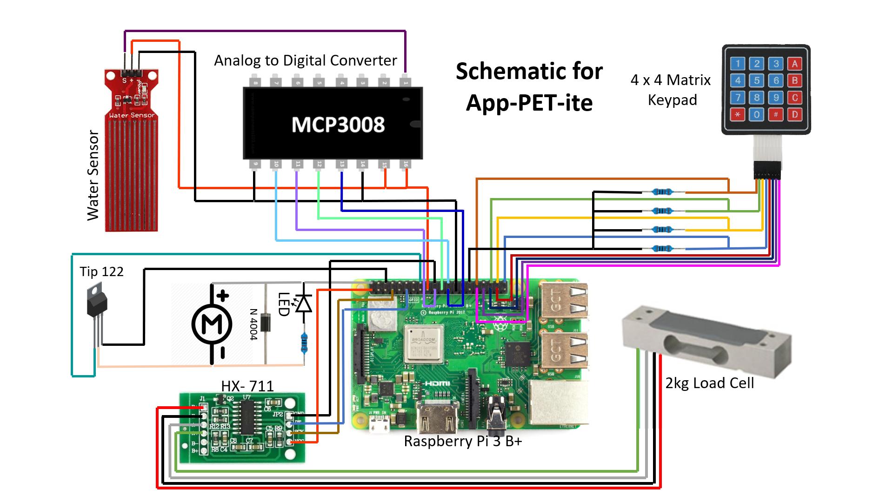
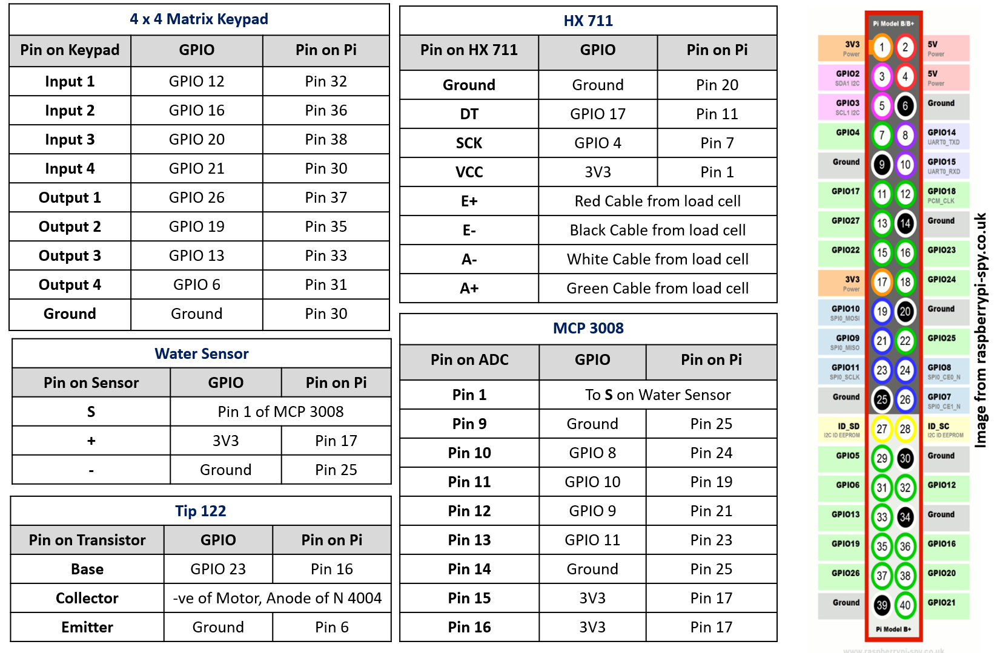
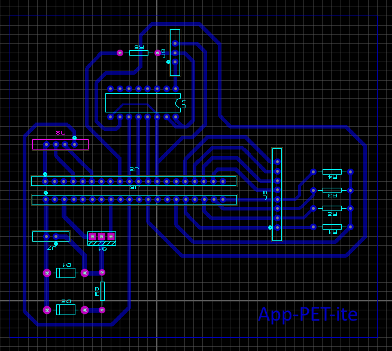

<br/>
## Social Media Profiles<br/>
**Youtube:**<br/>
**Twitter:**<br/>
**Instagram:**<br/>
**Facebook:**<br/>

## Project Overveiw<br/>
The basic layout of the project is given in the figure below<br/>
<br/>

## Project Description<br/>
The below schematic provides an outline for an automatic pet feeder. It dispenses food and liquid in a controlled manner, and montitors the amount of food/liquid. The pet is provided a RFID fob, which, in the vicinity of the the RFID reader, instructs the controller to dispense food with respect to an earlier programmed quantity. The water level and load are measured by sensors and provided to the Raspberry pi using SPI interface. The user is provided with a keypad and a LCD Panel to interact with the system.

## Project Prerequisites


## Component List<br/>
For this DIY project, we are using the Raspberry pi 3 Model B+ along with the following [Component List](https://github.com/RabiyaF/App-PET-ite/wiki/Component-List).<br/> <br/>

**Electrical Components List** <br/>
**1)** 1 Analog water sensor<br/>
**2)** 1 Analog-to-digital Converter [MCP3008] <br/>
**3)** 1 4x4 Matrix Keypad <br/>
**4)** 1 Analog Weight Sensor [HX711] with a maximum weight of 2 kgs <br/>
**5)** 5 1K Resistors <br/>
**6)** 1 TIP 122 <br/>
**7)** 1 LED <br/>
**8)** 1 Diode 1N4004 <br/><br/>
**Mechcanical Components List**<br/>
**1)** 1 DC Motor [6 Volts-150 RPM]<br/>
**2)** 1 Pet Food Bowl<br/> 

## Schematic<br/>
<br/>

## Electrical Connections<br/>
<br/>

## Flowchart<br/>
<br/>

## PCB Design <br/>
 <br/>
The figure above gives a preveiw of the PCB design. It includes the circuitry for Water Level Sensor, the ADC (MCP3008), the load cell (HX711), the key pad and the motordrive circuit. The PCB can be fabricated by printing the pdf file in the PCB folder and then using that layout to make a PCB step-by-step. A tutorial to make a PCB can be found at the following link
```
https://maker.pro/pcb/tutorial/how-to-make-a-printed-circuit-board-pcb
```

## Mechanical Design <br/>
 <br/>
Shown above are a screenshot of the 3D CAD model and a photo of the final mechanical assembly.  The frame is made simply out of wood, and the clamps for the food and water tanks are made out of rigid PVC pipe with slots made in one side.  Everything else non-electrical is easily sourced in most supermarkets.  

The only other part requiring significant manufacturing is the dispenser mechanism, which was 3D printed.  Shown below is a screenshot of this part.  For the .stl file of this component and the SolidWorks files of all the components shown in the full assembly, see the [SolidWorks/Mark 3](https://github.com/RabiyaF/App-PET-ite/tree/master/Solidworks/Mark%203) folder.  For a full walkthrough of how we assembled the feeder, see the [Step-by-Step Assembly] page.
