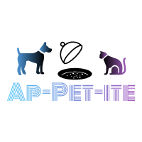

<br/>
## Social Media Profiles<br/>
[**Youtube**](https://www.youtube.com/channel/UCCG3uzNam2p5G15IFZl3F-A) 
[**Facebook**](https://www.facebook.com/Ap-PET-ite-2111281949162044/?view_public_for=2111281949162044)<br/>

## Project Overveiw<br/>
The basic layout of the project is given in the figure below<br/>
<br/>

## Project Description<br/>
The schematic above provides an overview of the project concept. The central component of the project design is a Raspberry Pi. The Pi is connected to peripheral devices that are used to control the food for a given Pet. The concept is not Pet specific and can be used to make an Automatic feeder for popular pets like cats or dogs and other smaller pets. The design includes two analog sensors to measure the weight and the water level. These sensors are connected to the Raspberry Pi through an ADC. SPI communication protocol is used to get analog values from the two sensors. A DC motor is controlled using a motor drive circuit. The user can interact with the Automatic Pet feeder through a user interface.<br/> 


## Component List<br/>
For this DIY project, we are using the Raspberry pi 3 Model B+ along with the following [Component List](https://github.com/RabiyaF/App-PET-ite/wiki/Component-List).<br/> <br/>
**Mechcanical Components List**<br/>
**1)** One DC Motor [6 Volts-150 RPM]<br/>
**2)** One Pet Food Bowl<br/> 
**3)** Wooden Planks<br/><br/>
**Electrical Components List** <br/>
**1)** One Analog water sensor<br/>
**2)** One Analog-to-digital Converter [MCP3008] <br/>
**3)** One 4x4 Matrix Keypad <br/>
**4)** One Analog Weight Sensor [HX711] with a maximum weight of 2 kgs <br/>
**5)** Five 1K Resistors <br/>
**6)** One TIP 122 or TIP 121 (NPN Transistor) <br/>
**7)** One LED <br/>
**8)** One Diode 1N4004 <br/>
**9)** Connector wires (F-F, M-F)<br/>
**10)** Two 20 Pin Female Connectors with a spacing of 0.1 in <br/>
**11)** One 8 pin Male connector with a spacing of 0.1 in <br/> 
**12)** One 4 pin Male connector with a spacing of 0.1 in <br/>
**13)** One 3 pin Male connector with a spacing of 0.1 in <br/>
**14)** One 16 pin IC holder with a spacing of 0.1 in between legs <br/>
After the Mechanical and Electrical Components have been procured, The following steps need to be followed to assemble App-PET-ite<br/>

# The Assembly 
## Mechanical Design Assembly <br/>
 <br/>
 <br/>
Shown above are a screenshot of the 3D CAD model and a photo of the final mechanical assembly.  The frame is made simply out of wood, and the clamps for the food and water tanks are made out of rigid PVC pipe with slots made in one side.  Everything else non-electrical is easily sourced in most supermarkets.  

 <br/>
The only other part requiring significant manufacturing is the dispenser mechanism, which was 3D printed.  Shown above are screenshots of this part.  For the .stl file of this component and the SolidWorks files of all the components shown in the full assembly, see the [SolidWorks/Mark 4](https://github.com/RabiyaF/App-PET-ite/tree/master/Solidworks/Mark%204) repository.  

For a full walkthrough of how we assembled the feeder, see the [Step-by-Step Assembly](https://github.com/RabiyaF/App-PET-ite/wiki/Step-by-Step-Mechanical-Assembly) page. <br/>

## Electrical Design Assembly <br/>
The first step of the electrical assembly is the PCB Fabrication.
### PCB Design <br/>
<br/>
The figure above gives a preveiw of the PCB design. It is a double layered PCB Design. It includes the circuitry for Water Level Sensor, the ADC (MCP3008), the load cell (HX711), the key pad and the motordrive circuit. The PCB can be fabricated by printing the pdf files in the Double sided PCB folder and then using that layout to make a PCB step-by-step. A tutorial to make a PCB can be found at the following link. For a doubled layered PCB design the alignment of the two layers must be perfect. While aligning PCB use the text on the bottom as a guide to align the top and bottom halves. For a double sided PCB the process discribed in the tutorial must be repeated twice.<br/>
```
https://maker.pro/pcb/tutorial/how-to-make-a-printed-circuit-board-pcb
```
### Schematic<br/>
The figure below gives the schematic on which the PCB design is based.<br/>
<br/>

### Electrical Connections<br/>
A summary of the electrical connection is given below. <br/> 
<br/>

## Ensuring Safety of Pet<br/>
Because of the nature of the project, It is recommneded to use the PCB layouts rather than using the schematic to build the circuit on a breadboard. All the wires must be taped down and all the electrical components should be out of the reach of the Pet. 

## Flowchart<br/>
The Flow chart below gives the overveiw of the code. First, the user initializes App-PET-ite with inputs for weight and time between two subsequent feeding times. The food is then dispensed based on user input. Then two threads run simulataneously. One counts down to the next time food is to be dispensed. The other thread periodically measures the Water level.  
<br/>

## Install the following packages using sudo apt-get <package name>
```
git 2.21.0
cmake-3.14.2.tar.gz
Qt 4.8.7
```
## To Run
```
git clone https://github.com/RabiyaF/App-PET-ite
cd Final_codes/build
cmake ..
make
./mypjex
```

## User Interface
The user interface is given below. First, the user is promted to enter the weight of food to be dispensed in hours. Then the user is promted to enter the time between subsequent feedings. Then the user is asked verify the data entry. Once the data is entered, the correct amount of food will be dispensed after the specified time intervals for the Pet to enjoy and no further input is needed from the Pet owner after that.
    <br/>  

## Team Members

* **Raghul** <br/> 
*Initial Concept Contribution* -App-PET-ite logo <br/>
2.Load cell setup and configuration<br/>
3.UI interface, repository maintenance.<br/>
4.Integration testing, Unit testing<br/>
* **Stuart Shilliday** <br/>
*Initial Concept Contribution* - Concept pitch presentation <br/>
*Mechanical Contribution* - Design, manufacture, iteration and assembly.  Step-by-Step Mechanical Assembly Wiki <br/>
*Social Media Contribution* - YouTube and Facebook pages; photography, videography, video editing and uploading <br/>
* **Rabiya Farooq**<br/> 
*Initial Concept Contribution* - Slides for pitch presentation <br/>
*Programming Contribution-* The ADC (MCP3008) for water level sensing, 4x4 Matrix Keypad, Motordrive control and threads for Water level sensor and timer <br/>
*Electronic Contribution-* PCB hardware design and testing <br/>

## Reporting a Bug
Use this link-[App-PET-ite Bug](https://github.com/RabiyaF/App-PET-ite/issues) to contact the team members to fix issues with software. <br/>
## Acknowledgements
The follwing libraries were used to build the code
```
https://github.com/berndporr/gpio-sysfs
https://github.com/halherta/RaspberryPi-mcp3008Spi
https://github.com/dangrie158/opencushion
https://git.drogon.net/?p=wiringPi;a=summary
```
## License
GNU General Public License V3<br/>
GNU LESSER GENERAL PUBLIC LICENSE V3<br/>

## Survey
PLease participate in this survey to give insight and feedback on Ap-PET-ite for future releases.<br/>
[Ap-PET-ite Survey](https://docs.google.com/forms/d/e/1FAIpQLSdCzQ5AlhaeOhvKFN2g8C_C-drHnjaCQEvHc7EBsoWmiBpvOg/viewform?usp=sf_link)

## Release Strategy
**Ap-PET-ite v1.0**
* Dispenses food of given mass at given intervals, and maintains water level, with inputs given from a UI. <br/>
Release date - 15th April 2019 <br/>

**Ap-PET-ite v2.0** 
* Depending on Survey results and general feedback, Version 2 will have following aditional funtionalities  <br/>
**1)** RFID Sensor (MFRC 522) for Pet identification and differentiation to allow feeding to be customized for each pet in a multipet household  <br/>and/or  <br/>
**2)** LCD Screen (ST 7735 128x160 pixel 1.8 inch Display) for the user to input and update the setting directly on to the Ap-PET-ite hardware <br/>

**Ap-PET-ite v3.0**
* The last version will enable an exclusive Mobile App and an ASIC chip and will be marketed for a commercial release.


